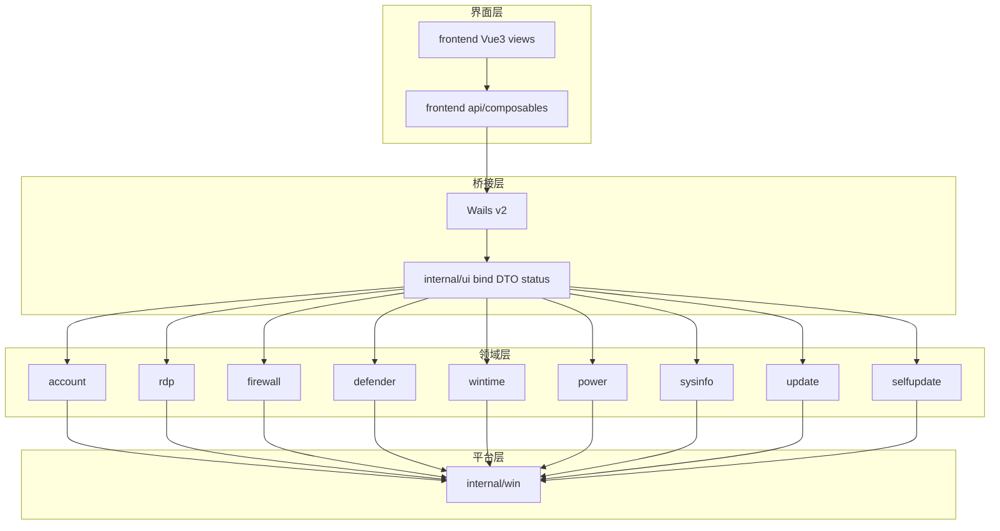

# WinToolbox

Windows 本地运维工具箱：Go + [Wails v2](https://wails.io) + Vue3 + Element Plus。  
版本：v1.1

## v1.1 更新说明

- 优化账户锁定策略：自定义参数默认优先回填当前系统值，缺省时回退到 `10 / 30 / 30`；一键开启锁定默认调整为 `10 / 30 / 30`
- 优化远程桌面、防火墙、时间同步等页面交互与状态刷新，减少首屏外的无效刷新请求
- 优化 Windows 兼容性：下载的更新包与 WebView2 安装器会尽力移除 `Mark-of-the-Web`，降低被 SmartScreen / Defender 拦截的概率
- 优化桌面构建链路：资源嵌入改为 `winres`，提升窗口图标与资源加载稳定性
- 升级 Go / Wails 相关依赖，并完成 `v1.1` 全量构建验证

## 功能

| 模块     | 能力                                                                                                  |
|----------|-------------------------------------------------------------------------------------------------------|
| 本机概览 | 主机名、系统+Build、激活、分辨率、IP、固定磁盘；硬件（厂商/型号/主板/BIOS/CPU/内存/内存条/硬盘/显卡） |
| 本地账户 | 改密码、启用/禁用、管理员权限；一键开启/关闭账户锁定                                                  |
| 远程桌面 | 开关、改端口并同步防火墙；查看/单条或全部清理 mstsc 连接记录                                          |
| 防火墙   | 一键开/关全部配置文件；一键禁 ping / 恢复 ping；放行/删除 TCP 端口，查看已创建规则                    |
| 防病毒   | 一键关闭/恢复 Windows Defender 实时防护                                                               |
| 时间同步 | 国际格式时区列表、常用 NTP 预设、立即同步                                                             |
| 电源     | 锁定、延时重启/关机（含 0 秒立即执行）、取消关机/重启                                                 |
| 系统更新 | 一键关闭/恢复 Windows Update；状态含策略与核心服务明细                                                |
| 软件更新 | 检测 GitHub Release，SHA256 校验后下载，确认后安装并重启                                              |

## 支持系统

Windows 10 / 11，Windows Server 2016 / 2019 / 2022 / 2025

需管理员权限。界面基于 WebView2；若未安装会自动联网下载并显示安装进度（防重复下载）。

## 架构



- **界面层**：页面只负责展示与确认；通过 `api` 调 Go。
- **桥接层**：`internal/ui` 聚合状态、校验参数、对外暴露 Wails 方法。
- **领域层**：各业务包互不依赖 UI；`update` = Windows Update，`selfupdate` = 本软件更新。
- **平台层**：`internal/win` 提供提权、隐藏执行、对话框、端口校验、WebView2 等。

## 项目结构

```
wintoolbox/
├── version.json            # 版本单一来源（build 时同步到 Go/前端/wails）
├── main.go                 # 入口：提权 → WebView2 → 启动 Wails
├── wails.json              # Wails / 产品元数据
├── app.manifest            # requireAdministrator
├── go.mod / go.sum
├── assets/
│   └── app.ico
├── scripts/
│   ├── build.ps1           # 同步版本 + 前端 + rsrc + go build
│   ├── sync-version.ps1    # 从 version.json 同步版本号
│   └── gen-rsrc-winres.go  # 嵌入 manifest + 图标
├── frontend/               # Vue3 + Element Plus + Vite
│   ├── public/
│   ├── src/
│   │   ├── api/            # 对 window.go.ui.App 的封装
│   │   ├── composables/    # 状态 / 操作 / runner
│   │   ├── components/     # OpLog 等
│   │   ├── views/          # 各功能页（与侧栏一一对应）
│   │   ├── App.vue         # 壳：导航、刷新、软件更新后台检查
│   │   ├── constants.js    # 菜单 / NTP 预设（版本由 sync-version 写入）
│   │   └── styles.css
│   └── package.json
├── internal/
│   ├── ui/                 # Wails 绑定、DTO、LoadStatus、窗口
│   │   ├── bind.go         # 对外 API
│   │   ├── dto.go          # 版本常量与结构体（版本由 sync-version 写入）
│   │   ├── status.go       # 状态聚合
│   │   ├── wails.go        # 窗口启动
│   │   └── util.go
│   ├── win/                # Windows 平台能力
│   │   ├── elevate/        # 管理员检测 / 提权
│   │   ├── syscmd/         # 隐藏执行 cmd / PowerShell
│   │   ├── dialog/         # MessageBox
│   │   ├── port/           # TCP 端口校验
│   │   └── webview2rt/     # WebView2 检测与安装
│   ├── account/            # 本地账户 + 锁定策略
│   ├── rdp/                # 远程桌面 + 连接历史
│   ├── firewall/           # 配置文件开关 + 端口规则
│   ├── defender/           # Defender 实时防护
│   ├── wintime/            # 时区 / NTP
│   ├── power/              # 锁定 / 重启 / 关机
│   ├── sysinfo/            # 本机概览
│   ├── update/             # Windows Update 开关
│   └── selfupdate/         # GitHub Release 自更新（SHA256）
```

### 前端 views 对照

| 侧栏     | 视图           | 后端包     |
|----------|----------------|------------|
| 本机概览 | OverviewView   | sysinfo    |
| 本地账户 | AccountView    | account    |
| 远程桌面 | RdpView        | rdp        |
| 防火墙   | FirewallView   | firewall   |
| 防病毒   | DefenderView   | defender   |
| 时间同步 | TimeView       | wintime    |
| 电源     | PowerView      | power      |
| 系统更新 | UpdateView     | update     |
| 软件更新 | SelfUpdateView | selfupdate |

### 交互约定

- 危险操作：Element Plus 确认框
- 成功：活动日志；失败：Message
- 首屏：`GetStatus` 快速返回；激活/硬盘/内存条/显卡由 `GetOverviewDetail` 后台补齐

## 构建

**依赖**：Go 1.22+（开发环境可用 1.27）、Node.js 18+、WebView2 Runtime

```powershell
.\scripts\build.ps1
```

开发模式（需安装 Wails CLI）：

```powershell
wails dev
```

手动 `go build` 时必须带标签：

```powershell
go build -tags "desktop,production" -ldflags "-s -w -H windowsgui" -o WinToolbox.exe .
```

## 运行

双击 `WinToolbox.exe` 按 UAC 提权，或以管理员身份运行。

## 技术栈

Go · Wails v2 · Vue3 · Element Plus · Windows API / netsh / w32tm / tzutil / slmgr / WebView2
