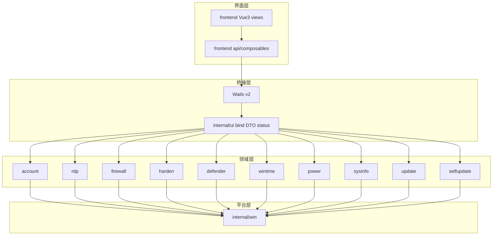

# WinToolbox

Windows 本地运维工具箱：Go + [Wails v2](https://wails.io) + Vue3 + Element Plus。  
版本：v1.2.0

## 文档

- [文档首页](./docs/README.md)
- [Windows 系统加固指南](./docs/windows-hardening.md)（图文 + 操作选项标注）
- [修改远程桌面端口](./docs/change-rdp-port.md)
- [关闭 / 恢复系统更新](./docs/disable-windows-update.md)
- [修改本地账户密码](./docs/change-password.md)

## v1.2.0 更新说明

- 新增 **安全加固** 页：一键禁用 SMBv1、关闭并拦截 WinRM、限制匿名枚举
- 新增账户能力：禁用来宾、关闭自动登录、密码策略；锁定策略支持自定义阈值/时长
- 远程桌面支持 **强制 NLA**；防火墙新增 **高危端口预设**（135/139/445/5985/5986）
- 全面加固状态探测与操作校验（写后复查、快照恢复、超时未知态提示）
- 优化各页状态刷新速度（批量探测、规则列表快速查询、防竞态序号）
- 新增图文操作文档（加固 / 改 RDP 端口 / 关更新 / 改密码）

## 功能

| 模块     | 能力 |
|----------|------|
| 本机概览 | 主机名、系统+Build、激活、分辨率、IP、磁盘与硬件信息 |
| 本地账户 | 改密码、启用/禁用、管理员；来宾/自动登录；锁定与密码策略 |
| 远程桌面 | 开关、改端口并同步防火墙、强制 NLA；清理 mstsc 连接记录 |
| 防火墙   | 一键开/关配置文件；禁 ping；高危端口预设；TCP 放行规则 |
| 安全加固 | SMBv1、WinRM、匿名枚举一键加固 |
| 防病毒   | 关闭/恢复 Defender 实时防护（含策略回退与复查） |
| 时间同步 | 时区、NTP 预设、立即同步、测试 NTP |
| 电源     | 锁定、延时重启/关机、取消计划 |
| 系统更新 | 关闭/恢复 Windows Update（快照恢复） |
| 软件更新 | GitHub Release 检测、SHA256 校验下载与安装 |

## 支持系统

Windows 10 / 11，Windows Server 2016 / 2019 / 2022 / 2025

需管理员权限。界面基于 WebView2；若未安装会自动联网下载并显示安装进度。

## 架构



## 项目结构

```
wintoolbox/
├── version.json
├── docs/                   # 操作文档与标注配图
├── scripts/build.ps1
├── frontend/src/views/     # 与侧栏一一对应
└── internal/               # account/rdp/firewall/harden/...
```

### 前端 views 对照

| 侧栏     | 视图           | 后端包     |
|----------|----------------|------------|
| 本机概览 | OverviewView   | sysinfo    |
| 本地账户 | AccountView    | account    |
| 远程桌面 | RdpView        | rdp        |
| 防火墙   | FirewallView   | firewall   |
| 安全加固 | HardenView     | harden     |
| 防病毒   | DefenderView   | defender   |
| 时间同步 | TimeView       | wintime    |
| 电源     | PowerView      | power      |
| 系统更新 | UpdateView     | update     |
| 软件更新 | SelfUpdateView | selfupdate |

## 构建

**依赖**：Go 1.22+（开发环境可用 1.27）、Node.js 18+、WebView2 Runtime

```powershell
.\scripts\build.ps1
```

开发模式（需安装 Wails CLI）：

```powershell
wails dev
```

## 运行

双击 `WinToolbox.exe` 按 UAC 提权，或以管理员身份运行。

## 下载与 SmartScreen

从 GitHub Release 下载的安装包**当前未做 Authenticode 代码签名**。Windows 可能提示 SmartScreen 拦截——多为未签名 + 新文件无下载信誉，不代表文件一定有害。

若确认来自本仓库 [Releases](https://github.com/datuzi-vip/wintoolbox/releases)：

1. **更多信息** → **仍要运行**
2. 用 Release / `*.sha256` 中的哈希校验后再运行

```powershell
Get-FileHash .\WinToolbox-v1.2.0.exe -Algorithm SHA256
```

## 技术栈

Go · Wails v2 · Vue3 · Element Plus · Windows API / netsh / w32tm / tzutil / slmgr / WebView2
