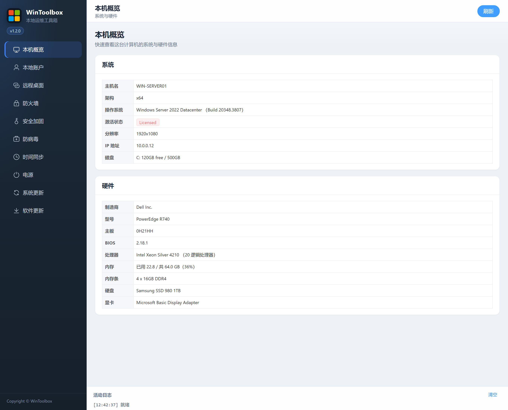

# 01 · 本机概览

查看本机系统与硬件信息（只读，无危险操作）。

## 第一步：下载

https://github.com/datuzi-vip/wintoolbox/releases/latest  

拦截点 **保留 / 保持**。详：[00 · 下载](./00-download.md)

## 界面

侧栏点 **本机概览**。页面展示：

| 区块 | 内容 |
|------|------|
| **系统** | 主机名、架构、操作系统与 Build、激活、分辨率、IP、磁盘空间 |
| **硬件** | 厂商/型号、主板、BIOS、CPU、内存与内存条、物理磁盘、显卡 |

右上角 **刷新** 可重新拉取状态。部分硬件细节可能异步补全。

返回：[文档首页](./README.md)
