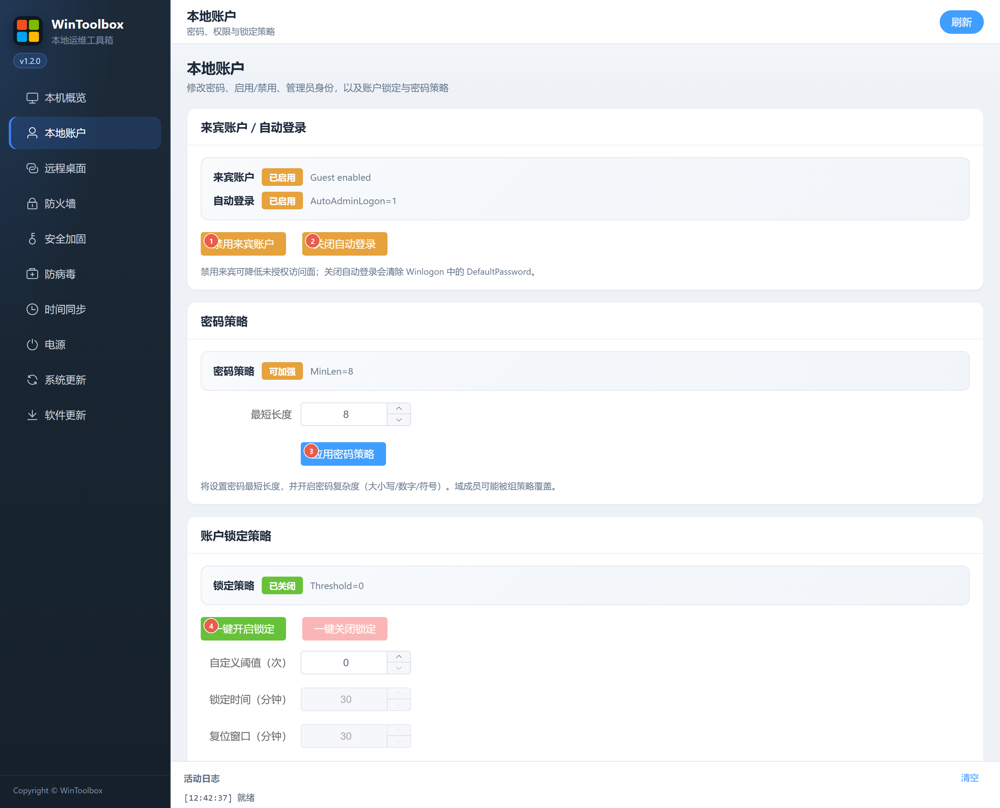
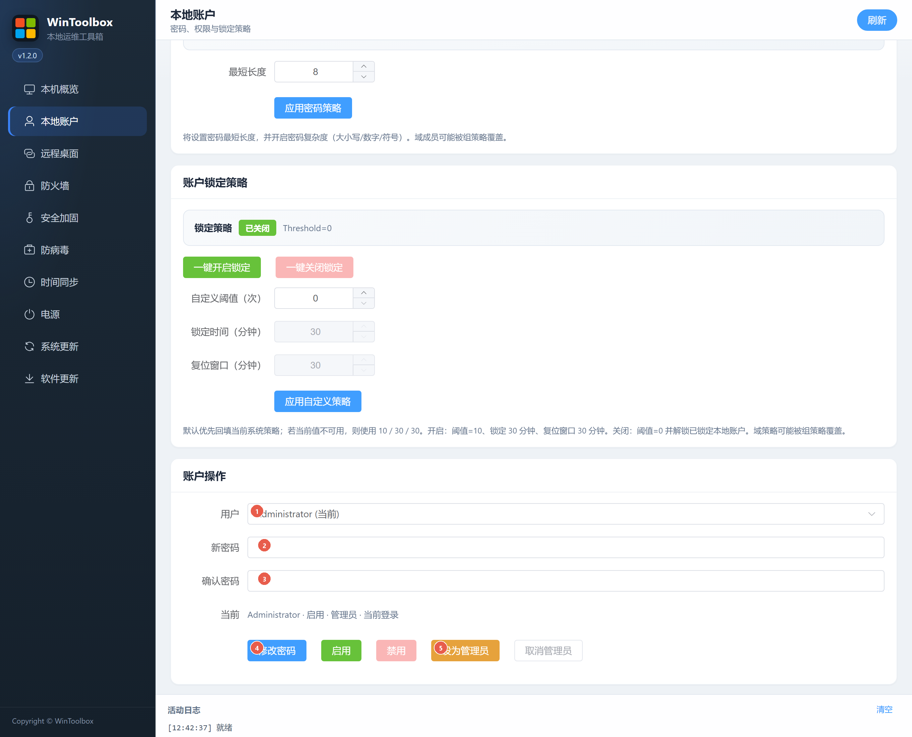

# 02 · 本地账户

禁用来宾与自动登录、加强密码/锁定策略，以及修改本地用户密码与权限。

## 第一步：下载

https://github.com/datuzi-vip/wintoolbox/releases/latest  

拦截点 **保留 / 保持**。详：[00 · 下载](./00-download.md)

## 策略与加固入口

| # | 按钮 | 说明 |
|---|------|------|
| ① | **禁用来宾账户** | 关闭 Guest，降低未授权入口 |
| ② | **关闭自动登录** | 关 AutoAdminLogon，并清除 DefaultPassword |
| ③ | **应用密码策略** | 设置最短长度，并开启复杂度 |
| ④ | **一键开启锁定** | 默认约 10 次失败 / 锁定 30 分钟（可自定义） |

也可在同页填写阈值后点 **应用自定义策略**。

## 修改密码与权限

向下滚动到 **账户操作**：

| # | 选项 | 说明 |
|---|------|------|
| ① | **用户** | 选择本地账户 |
| ② | **新密码** | 输入新密码 |
| ③ | **确认密码** | 与 ② 一致 |
| ④ | **修改密码** | 确认后生效 |
| ⑤ | **设为管理员** | 将所选用户加入管理员组（旁有启用/禁用、取消管理员） |

## 建议步骤

1. 管理员打开 WinToolbox → **本地账户**  
2. ①②③④ 按需加固  
3. 选用户 → 填两次密码 → **修改密码**  
4. 用新密码登录验证一次  

密码建议长度 ≥ 12（服务器 ≥ 14），含大小写、数字与符号。本页只管**本地账户**（域账户受域策略约束）。

相关：[90 · 系统加固指南](./90-hardening-guide.md) · [03 · 远程桌面](./03-remote-desktop.md)
