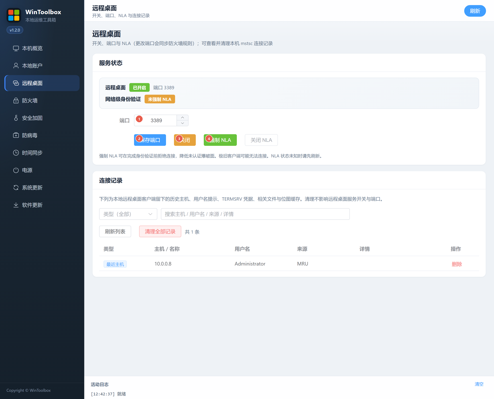

# 03 · 远程桌面

修改 RDP 端口、开关服务、强制 NLA，并管理本机连接记录。

## 第一步：下载

https://github.com/datuzi-vip/wintoolbox/releases/latest  

拦截点 **保留 / 保持**。详：[00 · 下载](./00-download.md)

## 界面标注

| # | 选项 | 说明 |
|---|------|------|
| ① | **端口** | 1–65535，避免长期使用 3389 |
| ② | **保存端口** | 写注册表，并同步 `WinToolbox-RDP` 防火墙放行 |
| ③ | **开启 / 关闭** | 开关远程桌面服务（图示为已开启时的「关闭」） |
| ④ | **强制 NLA** | 认证前拒绝连接；极旧客户端可能连不上 |

下方 **连接记录** 可筛选、删除单条或 **清理全部记录**（含主机历史、凭据提示等缓存）。

## 步骤

1. **远程桌面** → 填写端口（①）→ **保存端口**（②）  
2. 未开启则点 **开启**（③）→ **强制 NLA**（④）  
3. 客户端使用 `IP:新端口`；云主机请同步安全组  

## 注意

- 公网请确认安全组是否仍放行旧 3389  
- 状态异常时先点右上角 **刷新**

相关：[90 · 系统加固指南](./90-hardening-guide.md) · [02 · 本地账户](./02-local-account.md)
