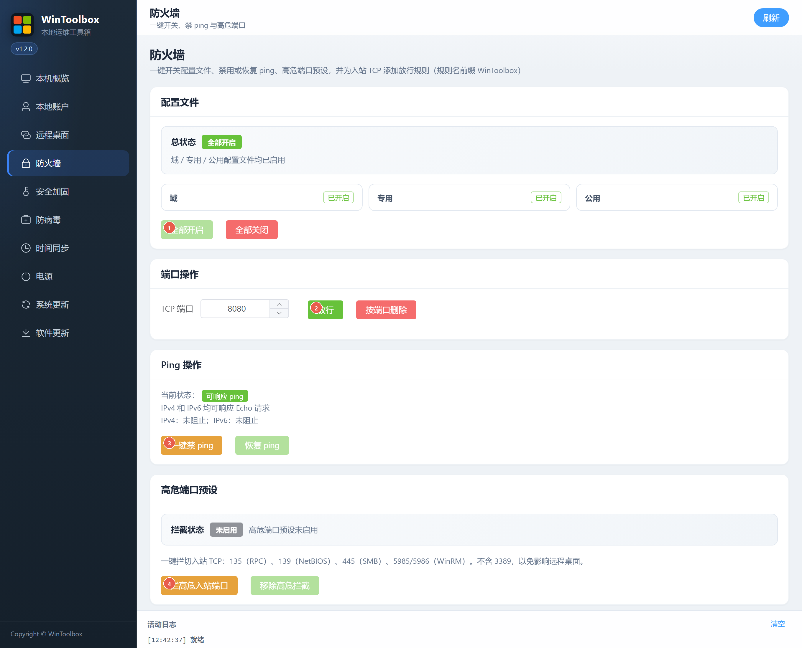

# 04 · 防火墙

一键开关配置文件、禁 ping、拦高危入站端口，以及按端口放行/删除规则。

## 第一步：下载

https://github.com/datuzi-vip/wintoolbox/releases/latest  

拦截点 **保留 / 保持**。详：[00 · 下载](./00-download.md)

## 界面标注

| # | 按钮 | 说明 |
|---|------|------|
| ① | **全部开启** | 域 / 专用 / 公用配置文件全部启用（旁有「全部关闭」） |
| ② | **放行** | 为填写的 TCP 端口添加入站放行（规则名前缀 WinToolbox） |
| ③ | **一键禁 ping** | 阻止 ICMPv4/v6 Echo（可 **恢复 ping**） |
| ④ | **拦高危入站端口** | 拦 135 / 139 / 445 / 5985 / 5986（**不含 3389**） |

同页还可 **按端口删除**、**移除高危拦截**，以及管理「已创建规则」列表。

## 步骤

1. **防火墙** → 确认配置文件为开启（必要时 ①）  
2. 运维需要时用 ② 放行业务端口  
3. 加固：③ 禁 ping → ④ 拦高危端口  

依赖文件共享 / WinRM 时慎用 ④。云主机还需在安全组同步策略。

相关：[90 · 系统加固指南](./90-hardening-guide.md) · [05 · 安全加固](./05-security-harden.md)
