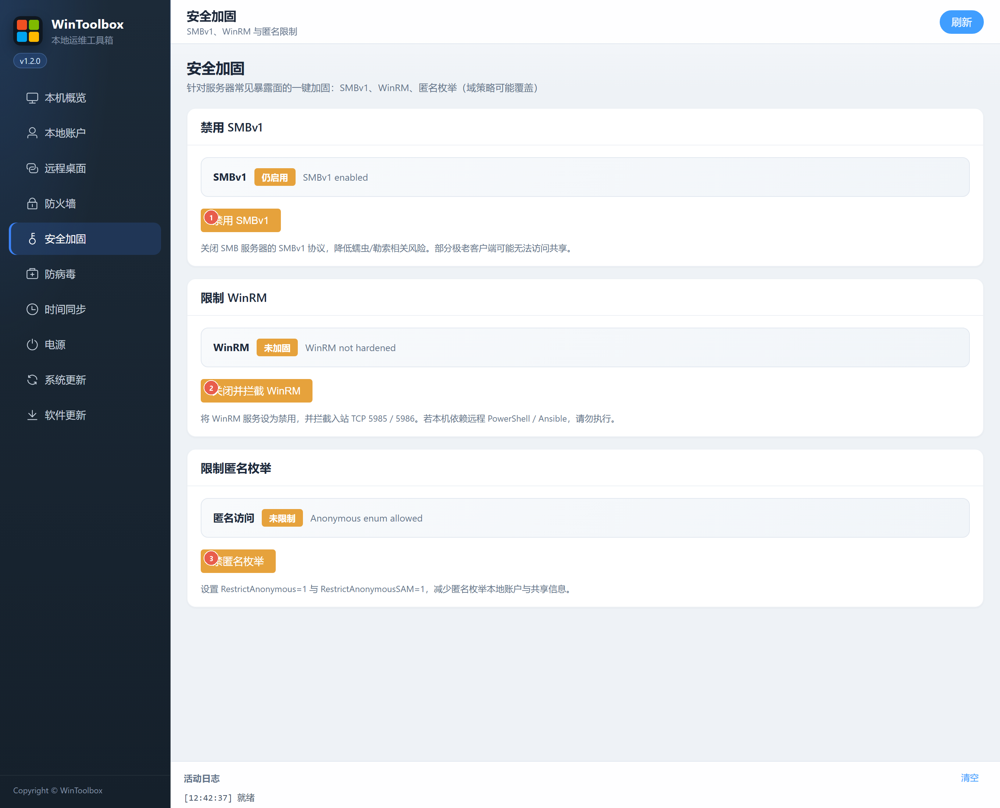

# 05 · 安全加固

针对常见暴露面：禁用 SMBv1、关闭并拦截 WinRM、限制匿名枚举。

## 第一步：下载

https://github.com/datuzi-vip/wintoolbox/releases/latest  

拦截点 **保留 / 保持**。详：[00 · 下载](./00-download.md)

## 界面标注

| # | 按钮 | 说明 |
|---|------|------|
| ① | **禁用 SMBv1** | 关闭 SMB 服务器的 SMBv1，降低蠕虫/勒索相关风险 |
| ② | **关闭并拦截 WinRM** | 禁用 WinRM 服务，并拦入站 TCP 5985 / 5986 |
| ③ | **禁匿名枚举** | RestrictAnonymous / RestrictAnonymousSAM |

## 注意

- 极老客户端访问共享时慎用 ①  
- 依赖远程 PowerShell / Ansible 时**不要**执行 ②  
- 域环境可能被组策略覆盖；操作后可用右上角 **刷新** 核对状态  

相关：[90 · 系统加固指南](./90-hardening-guide.md) · [04 · 防火墙](./04-firewall.md)
