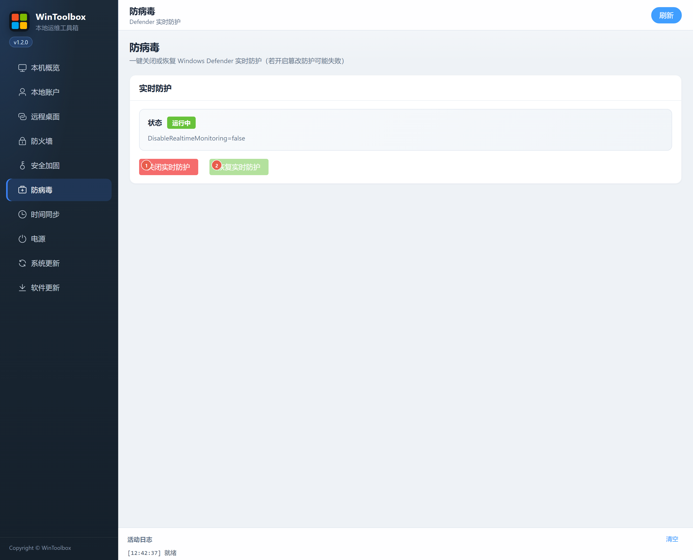

# 06 · 防病毒

一键关闭或恢复 Windows Defender **实时防护**。

## 第一步：下载

https://github.com/datuzi-vip/wintoolbox/releases/latest  

拦截点 **保留 / 保持**。详：[00 · 下载](./00-download.md)

## 界面标注

| # | 按钮 | 说明 |
|---|------|------|
| ① | **关闭实时防护** | 临时关闭 Defender 实时监控（有风险） |
| ② | **恢复实时防护** | 重新开启实时监控 |

## 注意

- 若开启 **篡改防护**，关闭可能失败，需先在 Windows 安全中心处理  
- 仅在明确需要的运维窗口关闭，用完立即 **恢复实时防护**  
- 状态显示「未知」时先点 **刷新**

相关：[文档首页](./README.md) · [09 · 系统更新](./09-windows-update.md)
