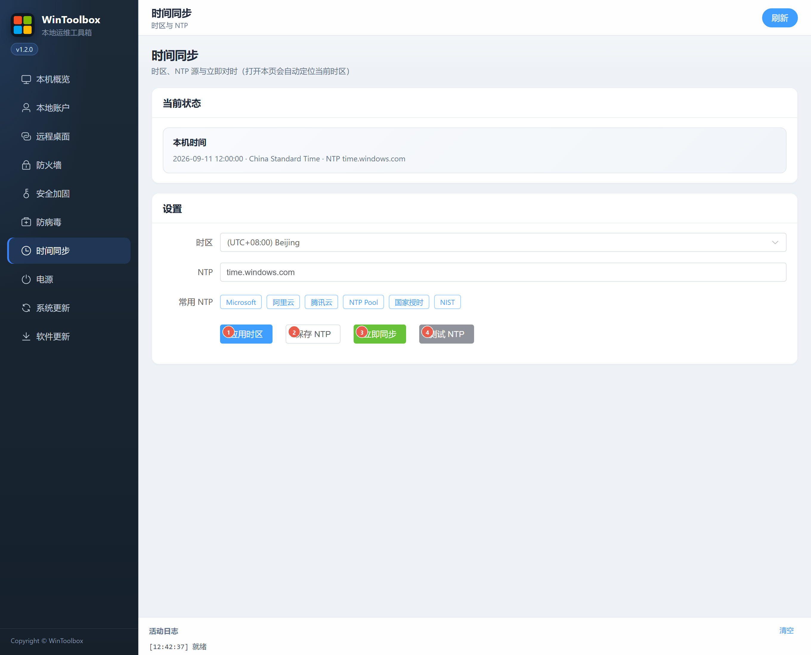

# 07 · 时间同步

设置时区、NTP 源，立即对时与连通性测试。

## 第一步：下载

https://github.com/datuzi-vip/wintoolbox/releases/latest  

拦截点 **保留 / 保持**。详：[00 · 下载](./00-download.md)

## 界面标注

| # | 按钮 | 说明 |
|---|------|------|
| ① | **应用时区** | 应用下拉框所选时区 |
| ② | **保存 NTP** | 写入 NTP 服务器地址 |
| ③ | **立即同步** | 立刻向当前 NTP 对时 |
| ④ | **测试 NTP** | 检测 NTP 是否可达 |

也可用「常用 NTP」芯片快速填入 Microsoft / 阿里云 / 腾讯云等。

打开本页会尽量自动定位当前时区。状态读取失败时会出现警告，稍后 **刷新** 再试。

相关：[文档首页](./README.md) · [08 · 电源](./08-power.md)
