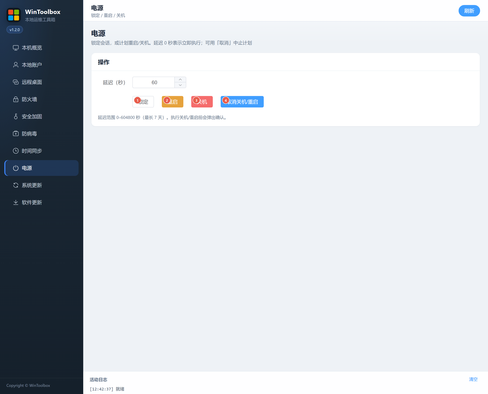

# 08 · 电源

锁定会话，或按延迟计划重启 / 关机，并可取消已计划的关机与重启。

## 第一步：下载

https://github.com/datuzi-vip/wintoolbox/releases/latest  

拦截点 **保留 / 保持**。详：[00 · 下载](./00-download.md)

## 界面标注

| # | 按钮 | 说明 |
|---|------|------|
| ① | **锁定** | 锁定当前会话（不影响计划关机） |
| ② | **重启** | 按「延迟（秒）」计划重启；0 表示立即（会确认） |
| ③ | **关机** | 按延迟计划关机；0 表示立即（会确认） |
| ④ | **取消关机/重启** | 中止已计划的关机或重启 |

延迟范围 0–604800 秒（最长 7 天）。远程操作前请确认不会误关生产机。

相关：[文档首页](./README.md) · [07 · 时间同步](./07-time-sync.md)
