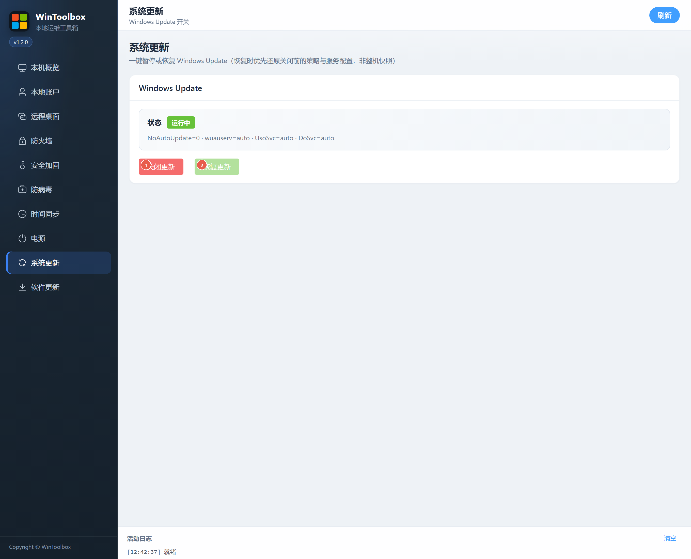

# 09 · 系统更新

一键暂停或恢复 Windows Update（恢复时优先还原关闭前的策略与服务配置，非整机快照）。

## 第一步：下载

https://github.com/datuzi-vip/wintoolbox/releases/latest  

拦截点 **保留 / 保持**。详：[00 · 下载](./00-download.md)

## 界面标注

| # | 按钮 | 说明 |
|---|------|------|
| ① | **关闭更新** | 暂停 Windows Update 相关策略/服务 |
| ② | **恢复更新** | 尽量还原关闭前配置 |

## 建议

- **常态建议保持更新开启**；仅在临时运维窗口关闭  
- 关闭后记得用 ② 恢复  
- 域/组策略环境可能无法被本工具完全覆盖  

相关：[90 · 系统加固指南](./90-hardening-guide.md) · [10 · 软件更新](./10-app-update.md)
