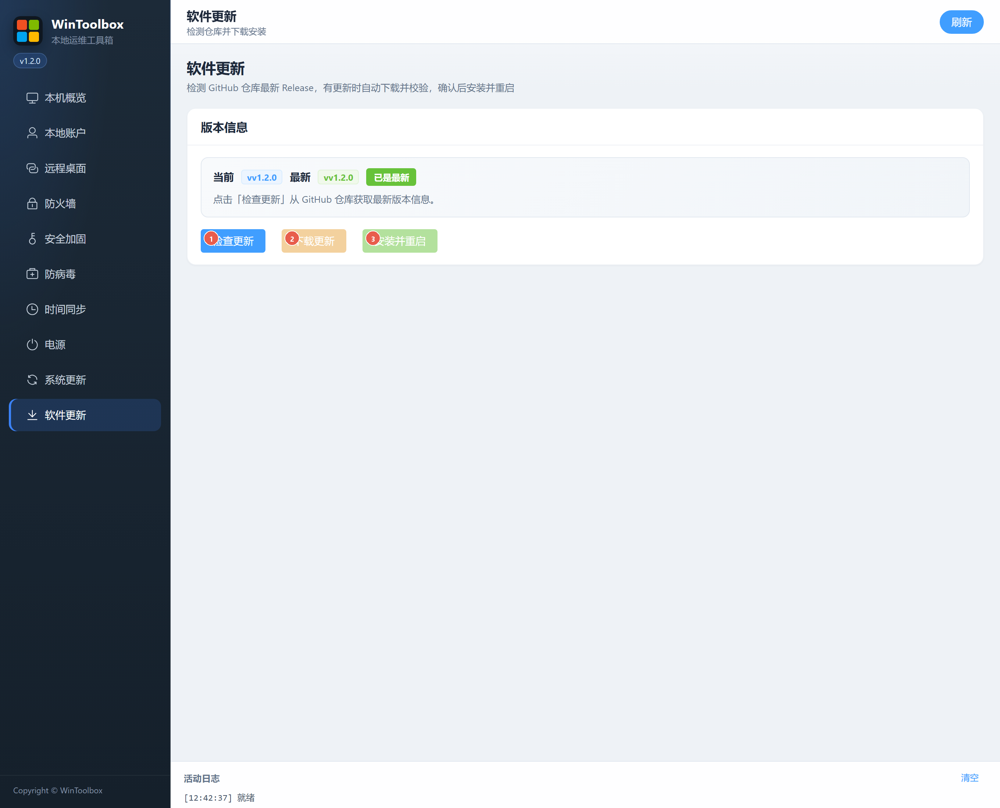

# 10 · 软件更新

检测 GitHub 仓库最新 Release，下载并校验后安装重启 WinToolbox 自身。

## 第一步：下载

若尚未安装，请先从 Release 获取安装包：  
https://github.com/datuzi-vip/wintoolbox/releases/latest  

拦截点 **保留 / 保持**。详：[00 · 下载](./00-download.md)

## 界面标注

| # | 按钮 | 说明 |
|---|------|------|
| ① | **检查更新** | 从 GitHub 拉取最新版本信息 |
| ② | **下载更新** | 有新版本时下载安装包并校验 |
| ③ | **安装并重启** | 校验通过后替换并重启应用 |

页面会显示当前 / 最新版本、是否有更新、SHA256 与本地路径等信息。

## 步骤

1. **软件更新** → **检查更新**  
2. 若提示有更新 → **下载更新**（等待校验成功）  
3. **安装并重启**  

需能访问 GitHub（或你配置的 Release 源）。网络失败时查看活动日志中的错误信息。

相关：[文档首页](./README.md) · [00 · 下载](./00-download.md)
