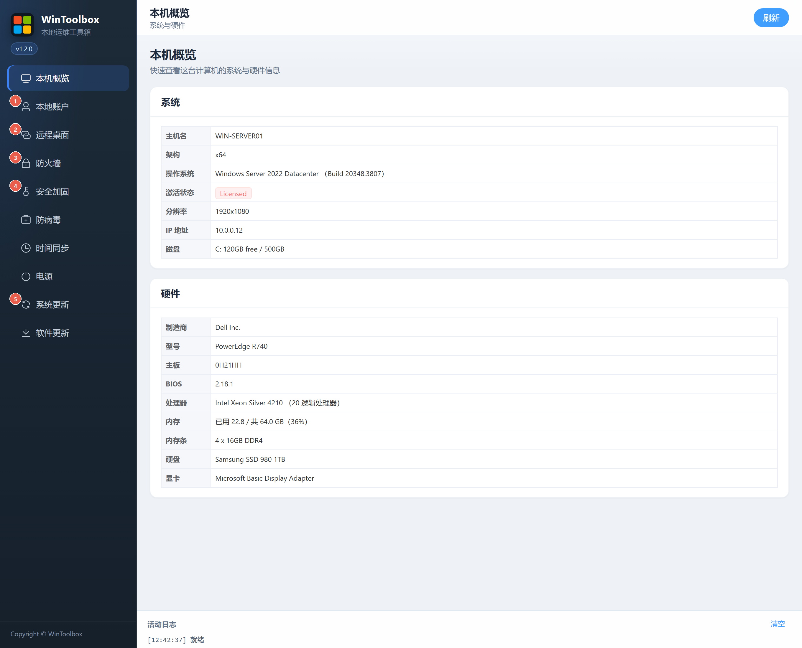

# 90 · Windows 系统加固指南

用 WinToolbox 按推荐顺序做常见暴露面加固。红点数字与界面标注对应。

## 第一步：下载

https://github.com/datuzi-vip/wintoolbox/releases/latest  

下载 `WinToolbox-v*.exe` → 拦截点 **保留 / 保持** → SmartScreen 选 **仍要运行** → **管理员**打开。  
详：[00 · 下载](./00-download.md)

## 推荐顺序（侧栏）

| # | 侧栏 | 做什么 | 详文 |
|---|------|--------|------|
| ① | 本地账户 | 禁用来宾、关自动登录、密码/锁定、改强密码 | [02 · 本地账户](./02-local-account.md) |
| ② | 远程桌面 | 改非常用端口、开启、强制 NLA | [03 · 远程桌面](./03-remote-desktop.md) |
| ③ | 防火墙 | 全部开启、禁 ping、拦高危端口 | [04 · 防火墙](./04-firewall.md) |
| ④ | 安全加固 | 禁用 SMBv1、关 WinRM、禁匿名枚举 | [05 · 安全加固](./05-security-harden.md) |
| ⑤ | 系统更新 | 仅临时运维窗口可关；常态建议开 | [09 · 系统更新](./09-windows-update.md) |

---

## 1. 本地账户

| # | 按钮 | 作用 |
|---|------|------|
| ① | **禁用来宾账户** | 关 Guest |
| ② | **关闭自动登录** | 关 AutoAdminLogon，清 DefaultPassword |
| ③ | **应用密码策略** | 最短长度 + 复杂度 |
| ④ | **一键开启锁定** | 防爆破 |

改密见：[02 · 本地账户](./02-local-account.md)

---

## 2. 远程桌面

| # | 选项 | 作用 |
|---|------|------|
| ① | **端口** | 勿长期用 3389 |
| ② | **保存端口** | 写注册表并同步防火墙放行 |
| ③ | **开启 / 关闭** | 开关 RDP |
| ④ | **强制 NLA** | 认证前拒绝连接 |

---

## 3. 防火墙

| # | 按钮 | 作用 |
|---|------|------|
| ① | **全部开启** | 域 / 专用 / 公用 |
| ② | **放行** | 业务端口入站放行 |
| ③ | **一键禁 ping** | 拦 ICMPv4/v6 Echo |
| ④ | **拦高危入站端口** | 135/139/445/5985/5986（不含 3389） |

---

## 4. 安全加固

| # | 按钮 | 作用 |
|---|------|------|
| ① | **禁用 SMBv1** | 关 SMBv1 协议 |
| ② | **关闭并拦截 WinRM** | 禁服务 + 拦 5985/5986 |
| ③ | **禁匿名枚举** | RestrictAnonymous / SAM |

依赖文件共享或远程 PowerShell 时慎用 ①②。

---

## 5. 系统更新

| # | 按钮 | 作用 |
|---|------|------|
| ① | **关闭更新** | 仅临时运维窗口 |
| ② | **恢复更新** | 用完务必恢复 |

---

## 说明

- 需**管理员权限**；域环境可能被组策略覆盖  
- 配图中软件页为**真实界面**；下载图为**模拟示意**  
- 其它功能：[01 · 概览](./01-overview.md) · [06 · 防病毒](./06-defender.md) · [07 · 时间](./07-time-sync.md) · [08 · 电源](./08-power.md) · [10 · 软件更新](./10-app-update.md)
