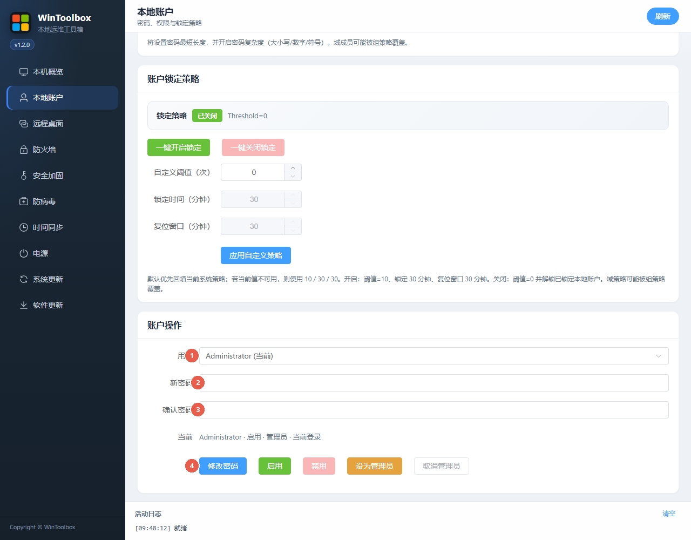

# Windows 修改本地账户密码（WinToolbox）

在 **本地账户** 改本地用户密码，并可加强策略与锁定。

## 第一步：下载

https://github.com/datuzi-vip/wintoolbox/releases/latest  

拦截点 **保留 / 保持**。详：[下载说明](./download.md)

## 改密界面

| # | 选项 | 说明 |
|---|------|------|
| ① | **用户** | 选本地账户 |
| ② | **新密码** | 输入新密码 |
| ③ | **确认密码** | 与 ② 一致 |
| ④ | **修改密码** | 确认后生效 |

## 建议一并做

| # | 按钮 | 说明 |
|---|------|------|
| ①② | **禁用来宾 / 关闭自动登录** | 减弱入口 |
| ③ | **应用密码策略** | 最短长度 + 复杂度 |
| ④ | **一键开启锁定** | 防爆破 |

## 步骤

1. **本地账户** → 选用户 → 填两次密码 → **修改密码**  
2. 可选：应用密码策略、开启锁定、关来宾/自动登录  
3. 用新密码登录验证一次  

## 建议

长度 ≥ 12（服务器 ≥ 14），含大小写/数字/符号。本页只管**本地账户**。

相关：[系统加固指南](./windows-hardening.md) · [改 RDP 端口](./change-rdp-port.md)
