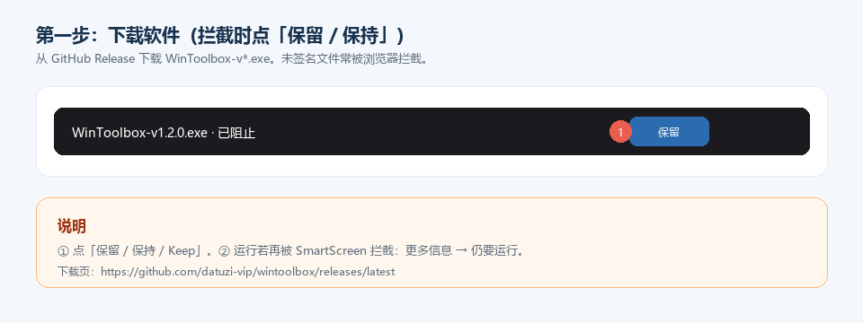
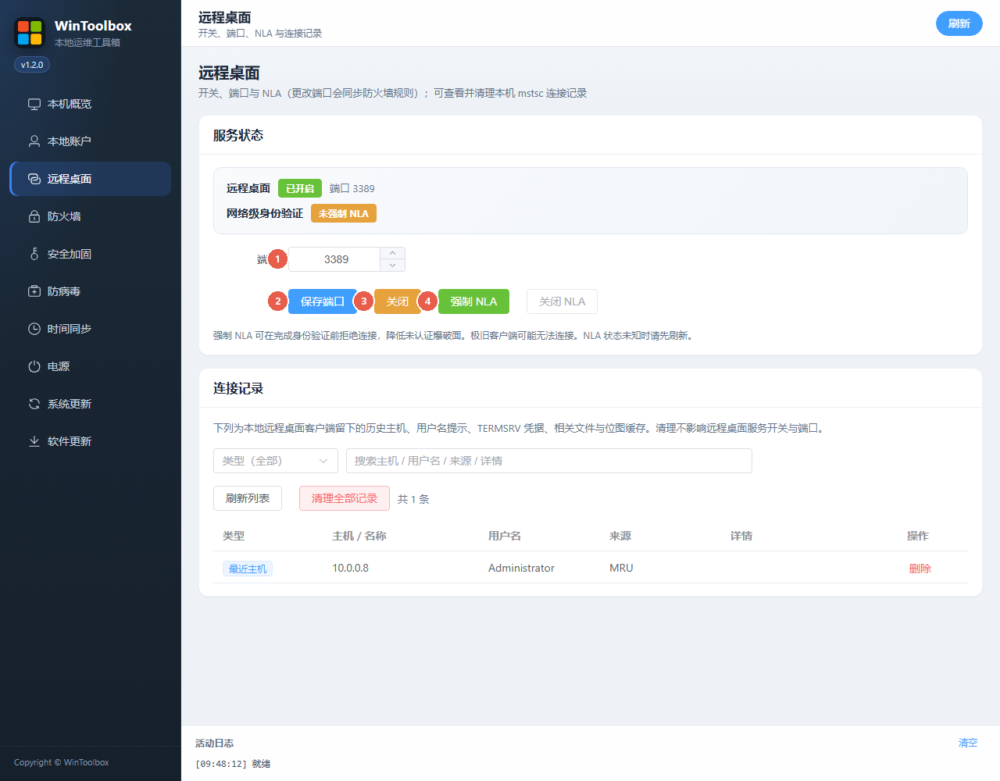

# Windows 修改远程桌面端口（WinToolbox）

把默认 3389 改为非常用端口，并开 NLA。

## 第一步：下载

https://github.com/datuzi-vip/wintoolbox/releases/latest  

拦截点 **保留 / 保持**。详：[下载说明](./download.md)

## 界面标注

| # | 选项 | 说明 |
|---|------|------|
| ① | **端口** | 1–65535，避开占用 |
| ② | **保存端口** | 同步 `WinToolbox-RDP` 放行规则 |
| ③ | **开启 / 关闭** | 服务保持「已开启」 |
| ④ | **强制 NLA** | 建议开；极旧客户端可能连不上 |

## 步骤

1. 管理员打开 WinToolbox → **远程桌面**  
2. 填端口（①）→ **保存端口**（②）  
3. 未开启则点 **开启**（③）→ **强制 NLA**（④）  
4. 客户端用 `IP:新端口`；云主机同步放行安全组  

## 注意

- 公网请确认安全组是否仍放行旧 3389  
- 状态「不可用 / NLA 未知」时先点右上角 **刷新**

相关：[系统加固指南](./windows-hardening.md) · [修改密码](./change-password.md)
