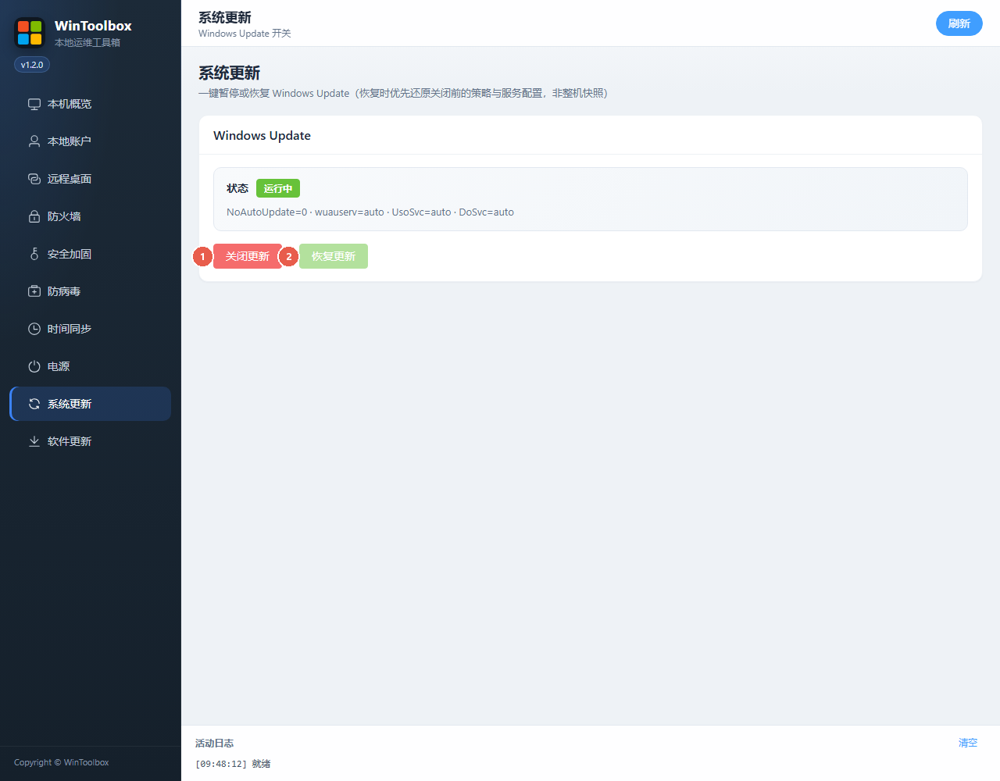

# Windows 关闭 / 恢复系统更新（WinToolbox）

临时暂停或恢复 Windows Update。适合运维窗口，**不建议长期关闭**。

## 第一步：下载

https://github.com/datuzi-vip/wintoolbox/releases/latest  

拦截点 **保留 / 保持**。详：[下载说明](./download.md)

## 界面标注

| # | 按钮 | 说明 |
|---|------|------|
| ① | **关闭更新** | 先写本机**配置备份**，再禁策略/调服务 |
| ② | **恢复更新** | 按关闭前配置备份还原 |

## 「配置备份」≠ 服务器快照

备份在本机注册表（WinToolbox 键），仅含更新策略与相关服务启动类型。  

**不会**整机回档，也**不是**云盘/虚拟机快照。

## 步骤

**关闭**：系统更新 → 确认非「未知」→ **关闭更新** → 状态变为已关闭。  

**恢复**：**恢复更新** → 状态回到运行中。

域 / Intune / WSUS 可能覆盖本机设置。

相关：[系统加固指南](./windows-hardening.md)
