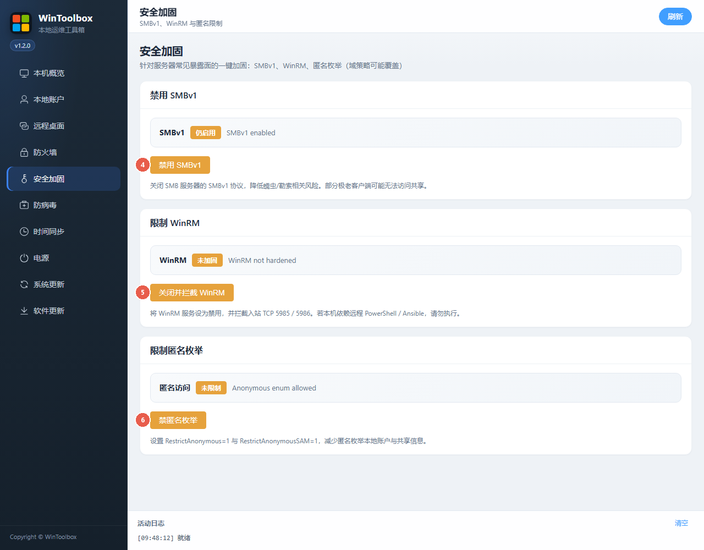

# Windows 系统加固指南（WinToolbox）

用 WinToolbox 做常见暴露面加固。红点数字 = 界面操作项。

## 第一步：下载

https://github.com/datuzi-vip/wintoolbox/releases/latest  

下载 `WinToolbox-v*.exe` → 拦截点 **保留 / 保持** → SmartScreen 选 **仍要运行** → **管理员**打开。  
详：[下载说明](./download.md)

## 推荐顺序

| # | 侧栏 | 做什么 |
|---|------|--------|
| ① | 本地账户 | 禁用来宾、关自动登录、密码/锁定策略、改强密码 |
| ② | 远程桌面 | 改非常用端口、开启、强制 NLA |
| ③ | 防火墙 | 全部开启、禁 ping、拦高危端口 |
| ④ | 安全加固 | 禁用 SMBv1、关 WinRM、禁匿名枚举 |
| ⑤ | 系统更新 | 仅临时运维窗口可关；常态建议开 |

---

## 1. 本地账户

| # | 按钮 | 作用 |
|---|------|------|
| ① | **禁用来宾账户** | 关 Guest |
| ② | **关闭自动登录** | 关 AutoAdminLogon，清 DefaultPassword |
| ③ | **应用密码策略** | 最短长度 + 复杂度 |
| ④ | **一键开启锁定** | 默认 10 次 / 30 分钟 |

改密步骤见：[修改本地账户密码](./change-password.md)

---

## 2. 远程桌面

| # | 选项 | 作用 |
|---|------|------|
| ① | **端口** | 勿长期用 3389 |
| ② | **保存端口** | 写注册表并同步防火墙放行 |
| ③ | **开启 / 关闭** | 开关 RDP |
| ④ | **强制 NLA** | 认证前拒绝连接 |

详：[修改远程桌面端口](./change-rdp-port.md)

---

## 3. 防火墙

| # | 按钮 | 作用 |
|---|------|------|
| ① | **全部开启** | 域 / 专用 / 公用 |
| ② | **一键禁 ping** | 拦 ICMPv4/v6 Echo |
| ③ | **拦高危入站端口** | 135/139/445/5985/5986（不含 3389） |

## 4. 安全加固

| # | 按钮 | 作用 |
|---|------|------|
| ④ | **禁用 SMBv1** | 关 SMBv1 协议 |
| ⑤ | **关闭并拦截 WinRM** | 禁服务 + 拦 5985/5986 |
| ⑥ | **禁匿名枚举** | RestrictAnonymous / SAM |

依赖文件共享或远程 PowerShell 时慎用 ③⑤。

---

## 5. 系统更新（可选）

| # | 按钮 | 作用 |
|---|------|------|
| ① | **关闭更新** | 写入策略并调整服务；先做本机**配置备份** |
| ② | **恢复更新** | 按关闭前配置备份还原（**不是**云主机磁盘快照） |

详：[关闭 / 恢复系统更新](./disable-windows-update.md)

---

## 自检

- [ ] 管理员已运行 WinToolbox  
- [ ] 来宾关、自动登录关、强密码、锁定开  
- [ ] RDP 非 3389 + NLA；客户端用 `IP:端口`  
- [ ] 防火墙全开；高危端口已拦（若不需要 SMB/WinRM）  
- [ ] SMBv1 / WinRM / 匿名已加固  
- [ ] 云安全组已放行**新 RDP 端口**

## 风险

改端口/防火墙可能导致失联——先留控制台。长期关更新不安全。域策略可能覆盖本机设置。
