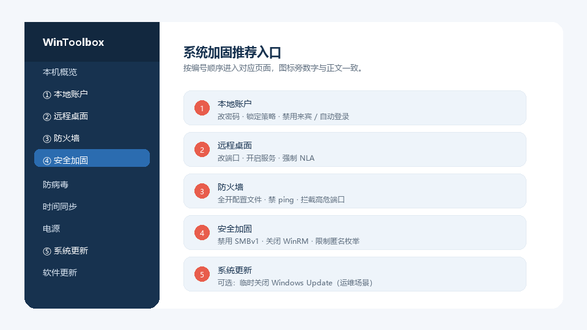
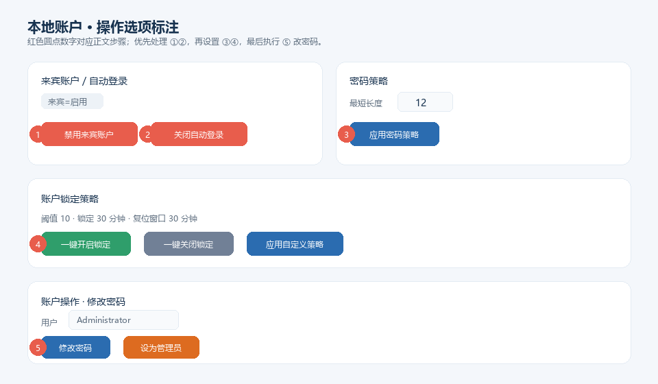
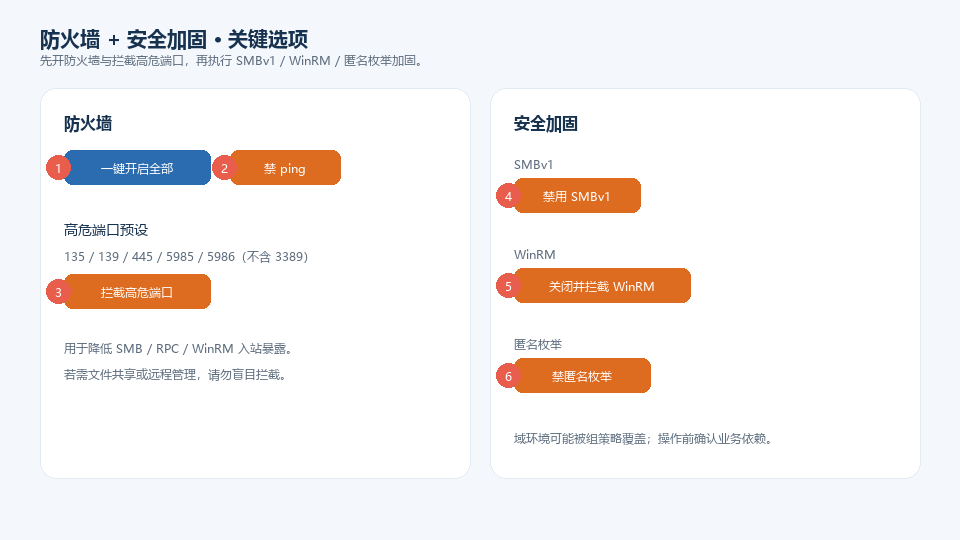

# Windows 系统加固指南（WinToolbox）

本文说明如何用 **WinToolbox** 对 Windows 10/11 与 Windows Server 做常见暴露面加固。配图中的 **红色数字圆标** 对应下方操作选项。

## 第一步：下载软件

1. 打开最新版下载页：https://github.com/datuzi-vip/wintoolbox/releases/latest  
2. 下载 **`WinToolbox-v*.exe`**。  
3. 若浏览器提示「已阻止 / 不安全」，展开菜单后点 **保留** / **保持**（Keep）；仍提示风险时选 **仍要保留**。  
4. 双击运行；若出现 SmartScreen，点 **更多信息 → 仍要运行**。  
5. 在 UAC 中允许，**以管理员身份**打开本工具。

更多说明见：[下载 WinToolbox](./download.md)

## 适用场景

- 公网或半公网暴露的云主机 / 跳板机
- 需要快速统一基线的本地服务器
- 临时加固窗口（仍建议保留必要远程通道）

## 推荐顺序总览

| 编号 | 侧栏入口 | 目标 |
|------|----------|------|
| ① | 本地账户 | 禁用来宾、关自动登录、锁定与密码策略、改强密码 |
| ② | 远程桌面 | 改非常用端口、开启服务、强制 NLA |
| ③ | 防火墙 | 全开配置文件、禁 ping、拦截高危端口 |
| ④ | 安全加固 | 禁用 SMBv1、关闭并拦截 WinRM、限制匿名枚举 |
| ⑤ | 系统更新 | 按需临时关闭（运维窗口）；常态建议保持开启 |

---

## 1. 本地账户

| 标注 | 操作选项 | 作用 |
|------|----------|------|
| ① | **禁用来宾账户** | 关闭 Guest，减少未授权入口 |
| ② | **关闭自动登录** | 关闭 AutoAdminLogon，并清除 DefaultPassword |
| ③ | **应用密码策略** | 设置最短长度，并开启复杂度 |
| ④ | **一键开启锁定** | 默认阈值 10、锁定/复位 30 分钟；可自定义后「应用自定义策略」 |
| ⑤ | **修改密码** | 为选定本地用户设置新密码 |

详细步骤见：[修改本地账户密码](./change-password.md)。

---

## 2. 远程桌面

| 标注 | 操作选项 | 作用 |
|------|----------|------|
| ① | **端口** | 填写 1–65535，避免长期使用默认 3389 |
| ② | **保存端口** | 写入注册表，并同步 `WinToolbox-RDP` 防火墙放行 |
| ③ | **开启 / 关闭** | 切换远程桌面服务 |
| ④ | **强制 NLA** | 认证前拒绝连接，降低未认证爆破面 |

详细步骤见：[修改远程桌面端口](./change-rdp-port.md)。

---

## 3. 防火墙 + 安全加固

### 防火墙

| 标注 | 操作选项 | 作用 |
|------|----------|------|
| ① | **一键开启全部** | 开启域 / 专用 / 公用配置文件 |
| ② | **禁 ping** | 拦截 ICMPv4/ICMPv6 Echo，降低扫描噪声 |
| ③ | **拦截高危端口** | 入站拦截 `135/139/445/5985/5986`（**不含 3389**） |

### 安全加固页

| 标注 | 操作选项 | 作用 |
|------|----------|------|
| ④ | **禁用 SMBv1** | 关闭 SMB 服务器的 SMBv1 协议 |
| ⑤ | **关闭并拦截 WinRM** | 禁用 WinRM 服务，并拦截 5985/5986 |
| ⑥ | **禁匿名枚举** | `RestrictAnonymous=1`、`RestrictAnonymousSAM=1` |

> 依赖文件共享、远程 PowerShell / Ansible 的机器：跳过或慎用 ③⑤。

---

## 4. 系统更新（可选）

| 标注 | 操作选项 | 作用 |
|------|----------|------|
| ① | **关闭更新** | 写入策略并调整相关服务，临时暂停自动更新 |
| ② | **恢复更新** | 优先按关闭前本工具记下的配置备份还原（不是云主机/磁盘快照） |

详细步骤见：[关闭 / 恢复系统更新](./disable-windows-update.md)。

---

## 加固后自检清单

- [ ] 已从 Release 下载并以管理员运行 WinToolbox
- [ ] 来宾已禁用，自动登录已关闭
- [ ] 管理员密码已更换，锁定策略已开启
- [ ] RDP 非 3389，NLA 已强制，客户端可用「IP:端口」连接
- [ ] 防火墙三配置文件均为「开」
- [ ] 高危端口状态为「已全部拦截」（若不需要 SMB/WinRM）
- [ ] SMBv1 / WinRM / 匿名枚举状态为已加固
- [ ] 云厂商安全组已同步放行**新 RDP 端口**

## 风险说明

1. 改端口或关防火墙规则错误可能导致**远程失联**；操作前保留控制台 / VNC / 带外通道。
2. 长期关闭 Windows Update 会积累漏洞风险。
3. 域环境以组策略为准，本机设置可能被覆盖。
4. 关闭 Defender 实时防护仅用于排障，不纳入本加固基线。
